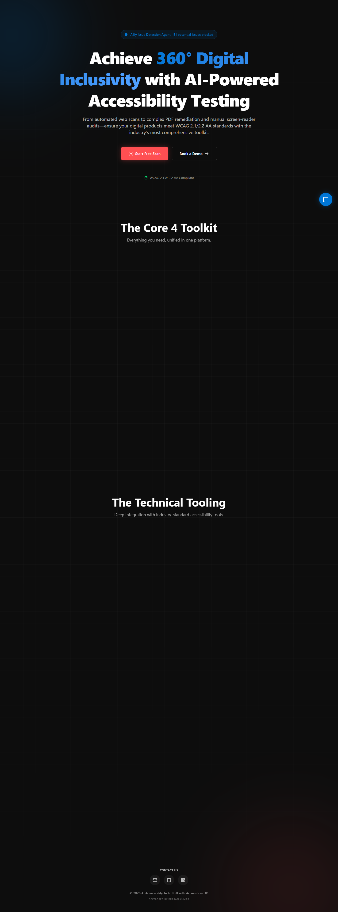
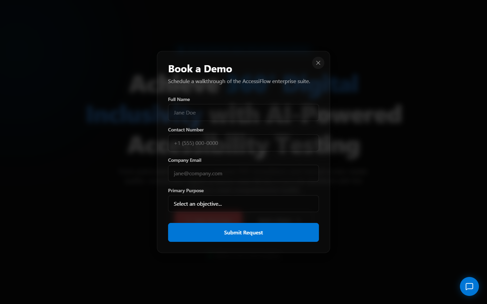
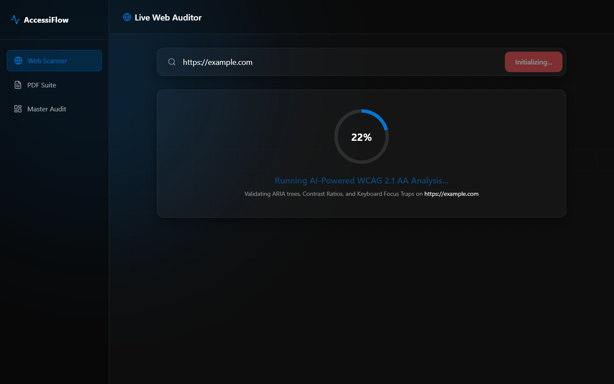

# AccessiFlow Platform KT & Architecture Walkthrough

This document outlines the architecture, tooling, and development pipeline for the **AccessiFlow** digital inclusion platform as developed by Prasan Kumar.

---

## 1. Executive Summary

AccessiFlow is a futuristic, highly interactive React-based Single Page Application. It is designed to act as a simulated AI-auditing engine for WCAG 2.1 & 2.2 AA validation. The application simulates complex auditing capabilities—such as DOM traversal, Contrast Ratio checking, and ARIA tree building—and can export consolidated testing results into "Master Audit" Excel `.xlsx` spreadsheets natively within the browser.

---

## 2. Technical Stack and Architecture

The platform relies on a modern build toolchain oriented towards speed, small bundles, and visually striking UX design.

- **Frontend Core:** React 18
- **Build Engine & Compilation:** Vite 8.0.3 + Node 22 (for strict ECMA script builds)
- **Styling Architecture:** TailwindCSS v4 with "Zero-Gravity" themed design tokens (Deep Space `#0d0d0d`, Brand Blue `#0076d6`, Accent Red `#ff4f52`).
- **Animations:** `framer-motion` for complex keyframes, modal mounting (`AnimatePresence`), and SVG loader ring strokes.
- **Routing:** `react-router-dom` mapping `/` to the `LandingPage` and `/dashboard` to the `Dashboard` scanner view.
- **Asset Generation:** `xlsx` library parsing 2D arrays directly into Office-spec spreadsheets dynamically for the Master Audit.

---

## 3. Visual Walkthrough & Core Components

### 3.1 The Landing Experience 

The root component (`/`) hosts the `LandingPage.jsx`. It includes a live-simulated issue counter ticking up and a feature matrix outlining the "Core 4" capabilities. 

*Figure 1: AccessiFlow Landing Page*


At the bottom of this page, contact logic maps directly to GitHub, LinkedIn, and Email anchors embedded neatly inside the footer components.

### 3.2 Lead Generation (The Modal System)

Attached to the Hero component is the **Book a Demo** trigger. Clicking this engages a deep `AnimatePresence` Framer window that prevents users from interacting with the background.

*Figure 2: Form Interaction Modal*


**Key Logic Highlight:** We implemented direct internal `useState` validation filtering out generic email patterns (like `@gmail.com` or `@icloud.com`) ensuring only company domains can register intent.

### 3.3 The Core Dashboard Simulator

If a user hits "Start Free Scan", `useNavigate()` bumps them to the `/dashboard` route.

*Figure 3: Dashboard Scanner Interface*


The scanning logic is a complex illusion. When a URL is submitted:
1. React sets `scanning=true`, locking inputs.
2. A `setInterval` block randomly increments a percentage counter while manipulating the `strokeDashoffset` property of a 377-point SVG circle.
3. Upon hitting 100%, the component unmounts the scanner loader and immediately mounts random pre-seeded "Critical" and "High" WCAG constraint violations arrays.

---

## 4. Master Audit Excel Generation

Inside the simulated payload output or specifically inside the `ReportingFeature.jsx`, users can download the mock **Master Audit**. 

The code uses the `xlsx` utility function `aoa_to_sheet`:

```javascript
const handleDownloadSample = () => {
    const sheetData = [
      ["Audit Date", new Date().toLocaleString()],
      ["Target URL", "https://accessiflow.org"],
      ...
    ];
    const worksheet = XLSX.utils.aoa_to_sheet(sheetData);
    const workbook = XLSX.utils.book_new();
    XLSX.utils.book_append_sheet(workbook, worksheet, "Sample Audit");
    XLSX.writeFile(workbook, `accessiflow-sample-report.xlsx`);
};
```

This bypasses backend logic completely, dumping a natively written file to the OS.

---

## 5. Google Cloud Run Deployment Protocol

The repository is built strictly to integrate via Google Cloud Container Registry.

**Dockerfile Architecture:**
```dockerfile
# Stage 1: Build the Vite React App
FROM node:22-alpine AS builder  # Strict compatibility with Vite 8
WORKDIR /app
COPY package.json package-lock.json ./
RUN npm ci
COPY . .
RUN npm run build

# Stage 2: Serve the app using NGINX
FROM nginx:alpine
COPY nginx.conf /etc/nginx/conf.d/default.conf # Maps ALL / routes to index.html for React Router
COPY --from=builder /app/dist /usr/share/nginx/html
EXPOSE 8080
```

### Deployment Commands:
```bash
gcloud run deploy accessiflow-landing \
   --source . \
   --project linkedin-landing-page-491707 \
   --region us-central1 \
   --allow-unauthenticated
```
It currently routes directly to `https://accessiflow-landing-643526693397.us-central1.run.app`.

---

# Validation Sign-off

This completes the visual walkthrough and architecture layout. The application is completely version-controlled, functional, containerized, and publicly accessible. 

<br><br><br>

***Submitted by Prasan Kumar***
